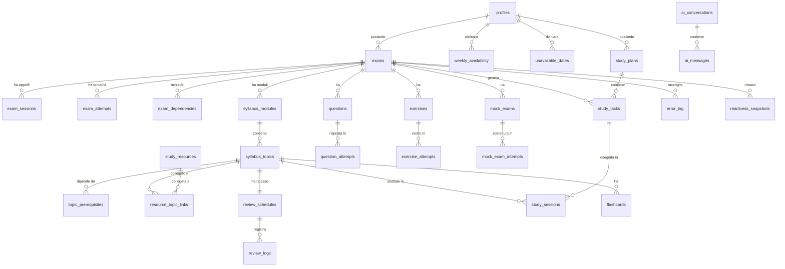

# StudyOS

Sistema operativo personale per lo studio universitario.

StudyOS non è un archivio di PDF né un calendario. Ogni giorno risponde a una domanda sola:

> «Ho un certo numero di ore disponibili: che cosa devo studiare oggi, per quanto tempo e come verifico di averlo davvero imparato?»

Obiettivo di riferimento del progetto: superare tutti gli esami entro il **30 settembre 2027**, studiando circa 2 ore nei giorni feriali e fino a 4 ore nel weekend, senza riempire ogni minuto disponibile.

---

## Indice

1. [Cosa fa](#cosa-fa)
2. [Stack tecnologico](#stack-tecnologico)
3. [Avvio rapido](#avvio-rapido)
4. [Configurazione di Supabase](#configurazione-di-supabase)
5. [Variabili d'ambiente](#variabili-dambiente)
6. [Migrazioni e dati iniziali](#migrazioni-e-dati-iniziali)
7. [Modello dati e diagramma ER](#modello-dati-e-diagramma-er)
8. [Come funzionano gli algoritmi](#come-funzionano-gli-algoritmi)
9. [Struttura del progetto](#struttura-del-progetto)
10. [Test](#test)
11. [Deploy su Vercel](#deploy-su-vercel)
12. [PWA e notifiche](#pwa-e-notifiche)
13. [Assistente AI (facoltativo)](#assistente-ai-facoltativo)
14. [Accessibilità](#accessibilità)
15. [Stato del progetto](#stato-del-progetto)

---

## Cosa fa

| Area | Funzioni |
| --- | --- |
| **Esami** | 14 esami precaricati, appelli reali 2026, appello principale e di riserva, date stimate da confermare, duplicazione sull'anno successivo, rilevamento dei conflitti, esiti e voti |
| **Prerequisiti** | 8 relazioni precaricate, grafo dei prerequisiti, creazione e rimozione libere |
| **Programma** | Esame → moduli → argomenti, riordino con trascinamento, modifica inline, importazione da testo, stima del tempo, difficoltà, «chiesto spesso all'esame» |
| **Pianificazione** | Motore automatico che rispetta il margine del 15%, al massimo 2 materie principali, alternanza teoria/esercizi, simulazione 10-14 giorni prima, nessun argomento nuovo negli ultimi giorni |
| **Sessione di studio** | Modalità concentrata con timer, obiettivo, checklist, pause, interruzioni, dubbi e conclusione guidata in 6 domande |
| **Ripassi** | Ripetizione dilazionata 1-3-7-14-30 giorni con adattamento e spiegazione sempre visibile della data scelta |
| **Recupero attivo** | Domande aperte, flashcard, modalità «spiega senza guardare», autovalutazione |
| **Esercizi** | Svolgimento, autovalutazione, tipologia dell'errore, invio automatico al quaderno degli errori |
| **Simulazioni** | Configurazione (scritto/orale/quiz/misto), punteggio, soglia, confronto con i tentativi precedenti |
| **Quaderno degli errori** | 8 tipologie di errore, causa, correzione, ripetizioni; gli errori ricorrenti alzano la priorità dell'argomento |
| **Preparazione** | Punteggio trasparente e configurabile: programma 20%, recupero attivo 25%, esercizi 25%, simulazioni 20%, ripassi 10% |
| **Fattibilità** | Verde / giallo / arancione / rosso / grigio, con le motivazioni sempre esposte |
| **Risorse** | Upload su Supabase Storage in cartelle per utente, link, tag, ricerca, collegamento agli argomenti |
| **Statistiche** | Ore per settimana ed esame, attività completate, andamento della memoria, errori più frequenti, scarto tra stime e realtà |
| **PWA** | Installabile, funziona offline sul piano già caricato, sincronizza le sessioni alla riconnessione |
| **Assistente AI** | Facoltativo, indipendente dal fornitore, con modalità «Interrogami»; nulla viene salvato senza conferma |

---

## Stack tecnologico

- **Next.js 15** (App Router, Server Components, Server Actions)
- **TypeScript** in modalità `strict` (con `noUncheckedIndexedAccess`)
- **Tailwind CSS 3** + componenti in stile **shadcn/ui** (Radix UI)
- **Supabase**: PostgreSQL, autenticazione, Storage
- **React Hook Form** + **Zod** per la validazione (client e server)
- **date-fns** con locale italiano
- **Recharts** per i grafici
- **Lucide** per le icone
- **Vitest** + **React Testing Library** per i test unitari
- **Playwright** per i flussi end-to-end
- PWA con manifest e service worker scritti a mano (nessuna dipendenza aggiuntiva)

---

## Avvio rapido

Requisiti: **Node.js ≥ 20.11** e npm.

```bash
# 1. Installa le dipendenze
npm install

# 2. Prepara le variabili d'ambiente
cp .env.example .env.local
#    poi compila NEXT_PUBLIC_SUPABASE_URL e NEXT_PUBLIC_SUPABASE_ANON_KEY

# 3. Applica le migrazioni (vedi sezione successiva)

# 4. Avvia in sviluppo
npm run dev
```

L'app è su <http://localhost:3000>. Al primo accesso: **Registrati → onboarding → il piano viene generato automaticamente**.

Comandi disponibili:

| Comando | Descrizione |
| --- | --- |
| `npm run dev` | Server di sviluppo |
| `npm run build` | Build di produzione |
| `npm start` | Avvio della build di produzione |
| `npm run lint` | ESLint (configurazione Next.js) |
| `npm run typecheck` | `tsc --noEmit` |
| `npm test` | Test unitari con Vitest |
| `npm run test:e2e` | Test end-to-end con Playwright |
| `npm run verify` | lint + typecheck + test + build |

---

## Configurazione di Supabase

1. Crea un progetto su <https://supabase.com> (piano gratuito sufficiente).
2. **Project Settings → API**: copia *Project URL* e *anon public key* in `.env.local`.
3. **SQL Editor**: esegui i file di `supabase/migrations/` **in ordine numerico**:
   - `0001_schema.sql` — tabelle, enum, indici, vincoli, trigger
   - `0002_rls.sql` — Row Level Security su tutte le tabelle
   - `0003_storage.sql` — bucket privato `study-materials` e relative policy
   - `0004_seed_function.sql` — funzione `seed_initial_data()` con esami, appelli, prerequisiti e programmi dimostrativi
4. **Authentication → Providers → Email**: lascia attivo l'accesso con email e password.
   - Per usare l'app subito senza attendere l'email, disattiva *Confirm email* in **Authentication → Sign In / Providers → Email**.
5. **Authentication → URL Configuration**: imposta *Site URL* su `http://localhost:3000` (e sull'URL di produzione dopo il deploy). Aggiungi `http://localhost:3000/auth/callback` fra i *Redirect URLs*.

> In alternativa, con la Supabase CLI: `supabase db push` applica i file della cartella `supabase/migrations`.

---

## Variabili d'ambiente

Il file `.env.example` contiene l'elenco completo. Nessun segreto è presente nel codice.

| Variabile | Obbligatoria | Descrizione |
| --- | --- | --- |
| `NEXT_PUBLIC_SUPABASE_URL` | sì | URL del progetto Supabase |
| `NEXT_PUBLIC_SUPABASE_ANON_KEY` | sì | Chiave pubblica (anon) |
| `SUPABASE_SERVICE_ROLE_KEY` | no | Solo per script di manutenzione lato server. **Mai** esporla al client |
| `NEXT_PUBLIC_SITE_URL` | consigliata | Usata nei link delle email di autenticazione |
| `AI_PROVIDER` | no | `anthropic`, `openai` oppure `none` (predefinito) |
| `AI_API_KEY` | no | Chiave del fornitore scelto |
| `AI_MODEL` | no | Modello specifico; se vuoto si usa quello predefinito |
| `AI_DAILY_REQUEST_LIMIT` | no | Limite giornaliero di richieste AI per utente (50) |

Se Supabase non è configurato, l'app mostra la pagina `/configurazione` con le istruzioni invece di andare in errore.

---

## Migrazioni e dati iniziali

I dati iniziali **non** sono inseriti con uno script globale: sono creati dalla funzione PostgreSQL `seed_initial_data()`, richiamata automaticamente al termine dell'onboarding e legata a `auth.uid()`. È quindi corretta anche in uno scenario multiutente ed è idempotente.

Crea, solo per l'utente autenticato:

- **14 esami** con difficoltà, CFU e ore stimate;
- **gli appelli reali del 2026** di 13 esami (Ingegneria del Software resta volutamente senza date, segnalato nell'interfaccia);
- **8 relazioni di prerequisito**;
- **appelli principali e di riserva** per le due priorità immediate:
  - Elementi di Elettronica → principale 27/08/2026, riserva 09/09/2026
  - Metodi Probabilistici → principale 15/09/2026, riserva 02/09/2026
- **disponibilità settimanale** 120 minuti nei feriali, 240 nel weekend;
- **programmi dimostrativi** di Elettronica e Metodi Probabilistici, marcati come *bozza da verificare con il programma ufficiale*.

Per rieseguirla a mano (per esempio dopo aver svuotato le tabelle), dall'SQL Editor con la sessione dell'utente:

```sql
select public.seed_initial_data();
```

---

## Modello dati e diagramma ER



### Stati principali (enum PostgreSQL)

| Enum | Valori |
| --- | --- |
| `exam_status` | `non_iniziato`, `pianificato`, `in_studio`, `pronto`, `tentato`, `superato` |
| `topic_status` | `non_iniziato`, `in_corso`, `studiato`, `da_ripassare`, `consolidato` |
| `task_status` | `pianificata`, `in_corso`, `completata`, `saltata`, `riprogrammata` |
| `resource_type` | `pdf`, `libro`, `video`, `link`, `appunti`, `formulario`, `prova_precedente` |
| `question_type` | `aperta`, `flashcard`, `scelta_multipla`, `esercizio` |
| `session_status` (appello) | `stimato`, `confermato`, `sostenuto`, `superato`, `non_superato`, `annullato` |
| `error_type` | `concettuale`, `calcolo`, `distrazione`, `formula_dimenticata`, `interpretazione`, `procedimento_incompleto`, `gestione_tempo`, `esposizione_orale` |
| `risk_level` | `verde`, `giallo`, `arancione`, `rosso`, `grigio` |

### Sicurezza

- RLS attiva e **forzata** su tutte le 30 tabelle; ogni policy usa `auth.uid()`.
- Le tabelle di dominio hanno `user_id → auth.users(id) on delete cascade`; `profiles` usa `id`.
- Storage: bucket privato, percorso obbligatorio `study-materials/<user_id>/…`, limite 50 MB, elenco chiuso di tipi MIME.
- Validazione server-side con Zod su **tutte** le Server Action, indipendentemente dai controlli lato client.
- Il test `tests/data-isolation.test.ts` verifica automaticamente che ogni query lato server sia filtrata per utente e che la RLS copra tutte le tabelle.

---

## Come funzionano gli algoritmi

Tutta la logica di dominio è in `src/lib/domain/`: funzioni pure, senza React né Supabase, coperte da test.

### Preparazione (`readiness.ts`)

Media pesata di cinque componenti, con i pesi configurabili dalle impostazioni:

| Componente | Peso predefinito | Come si calcola |
| --- | --- | --- |
| Programma completato | 20% | Copertura pesata sul tempo stimato di ogni argomento (uno stato «in corso» vale 0,35, «consolidato» vale 1) |
| Recupero attivo | 25% | Tasso di risposte corrette, *smorzato*: 2 risposte giuste su 2 non valgono il 100% |
| Esercizi | 25% | Come sopra, sui tentativi registrati |
| Simulazioni | 20% | Media pesata, con più peso ai tentativi recenti |
| Regolarità dei ripassi | 10% | Ripassi svolti in tempo su quelli previsti |

Se una componente non è applicabile (esercizi in un'idoneità linguistica, ripassi non ancora programmati) **il peso viene redistribuito** sulle altre. Il risultato include sempre: valore complessivo, comprensione, memoria, applicazione, prestazione nelle simulazioni e **affidabilità della stima**. Sotto il 25% di affidabilità l'interfaccia dichiara «dati insufficienti» invece di mostrare un numero fuorviante.

### Ripetizione dilazionata (`spaced-repetition.ts`)

Intervalli base 1, 3, 7, 14, 30 giorni; oltre il quinto ripasso l'intervallo cresce con il fattore di facilità (1,3–3,5).

| Risposta | Effetto |
| --- | --- |
| Non ricordavo | Si riparte da 1 giorno, facilità −0,30 |
| Ricordavo con molta difficoltà | Intervallo dimezzato, facilità −0,15 |
| Ricordavo parzialmente | Intervallo ×0,8 |
| Ricordavo bene | Si prosegue con la sequenza |
| Ricordavo perfettamente | Intervallo allungato, facilità +0,15 |

Ogni calcolo restituisce la **spiegazione in italiano** della data scelta, mostrata nell'interfaccia. Se la data supera l'appello, viene anticipata al giorno dell'esame.

### Punteggio di priorità (`priority.ts`)

Otto componenti pesate: urgenza (30%), distanza dalla preparazione (22%), carico rispetto al tempo (13%), prerequisito per altri esami (10%), attività arretrate (9%), difficoltà (8%), priorità manuale (5%), errori ricorrenti (3%). Nella pagina «Oggi» le tre motivazioni più rilevanti sono visibili sotto ogni attività.

### Motore di pianificazione (`planner.ts`)

Regole applicate giorno per giorno:

- non si usa mai più dell'85% del tempo disponibile (margine configurabile);
- al massimo 2 materie principali contemporaneamente; una terza (per esempio l'inglese) solo in sessioni brevi da 30 minuti;
- i ripassi in scadenza precedono il nuovo programma;
- teoria ed esercizi si alternano;
- la prima simulazione entro i 14 giorni precedenti l'appello;
- nessun argomento nuovo negli ultimi 6 giorni;
- gli argomenti bloccati da prerequisiti non ancora completati vengono rimandati;
- quando un appello è passato, il tempo passa automaticamente alla materia successiva;
- se il lavoro non entra nel tempo disponibile il motore **lo segnala e propone l'appello di riserva, senza cambiarlo da solo**.

### Riprogrammazione (`reschedule.ts`)

Il lavoro saltato non viene ammassato sul giorno dopo: viene distribuito sui giorni successivi rispettando la capacità residua e un tetto di 60 minuti di recupero al giorno, eventualmente spezzando l'attività. Ciò che non trova spazio viene segnalato.

### Fattibilità (`feasibility.ts`)

Combina carico rispetto al tempo, scarto di preparazione, copertura del programma, ritmo reale delle ultime due settimane, simulazioni svolte e ripassi arretrati. Sotto i 5 dati registrati la valutazione resta **grigia**. I messaggi non colpevolizzano mai.

---

## Struttura del progetto

```
StudyAI/
├── e2e/                          # test end-to-end Playwright
├── docs/
│   └── architecture.md           # decisioni architetturali
├── public/
│   ├── icons/                    # icone PWA (192, 512, maskable)
│   ├── manifest.webmanifest
│   └── sw.js                     # service worker
├── src/
│   ├── app/
│   │   ├── (auth)/               # accedi, registrati, recupero password
│   │   ├── (app)/                # area protetta con sidebar e bottom nav
│   │   │   ├── dashboard/  oggi/  esami/  piano/  calendario/
│   │   │   ├── ripassi/  domande/  esercizi/  simulazioni/
│   │   │   └── errori/  risorse/  statistiche/  assistente/  impostazioni/
│   │   ├── auth/callback/        # scambio del codice email → sessione
│   │   ├── onboarding/           # procedura guidata in 4 passi
│   │   ├── sessione/[sessionId]/ # modalità concentrata
│   │   ├── configurazione/       # istruzioni se manca Supabase
│   │   └── offline/              # pagina di fallback del service worker
│   ├── components/
│   │   ├── ui/                   # componenti base in stile shadcn/ui
│   │   ├── layout/  shared/  plan/  exams/  pwa/
│   ├── lib/
│   │   ├── domain/               # logica pura + test  ← cuore del sistema
│   │   ├── supabase/             # client browser, server e middleware
│   │   ├── validation/           # schemi Zod condivisi
│   │   ├── ai/                   # astrazione del fornitore AI
│   │   └── navigation.ts  utils.ts
│   ├── server/
│   │   ├── data.ts               # tutte le letture, senza query duplicate
│   │   └── actions/              # Server Action per area funzionale
│   ├── types/db.ts               # tipi delle righe del database
│   └── middleware.ts             # refresh sessione e protezione route
├── supabase/migrations/          # 0001 → 0004
├── tests/                        # test di isolamento dati e migrazioni
└── PROGRESS.md                   # stato di avanzamento
```

Principio seguito: **la logica di dominio non conosce l'interfaccia**. Le pagine leggono da `src/server/data.ts`, scrivono tramite Server Action e delegano ogni calcolo a `src/lib/domain/`.

---

## Test

```bash
npm test          # 98 test unitari e di integrazione
npm run test:e2e  # flussi end-to-end (richiede Supabase configurato)
```

Copertura dei test unitari:

| File | Cosa verifica |
| --- | --- |
| `readiness.test.ts` | Calcolo della preparazione, redistribuzione dei pesi, «dati insufficienti», il solo programma letto non porta al 100% |
| `spaced-repetition.test.ts` | Sequenza 1-3-7-14-30, effetto di ogni voto, limite alla data dell'appello, presenza della spiegazione |
| `priority.test.ts` | Monotonia dell'urgenza, effetto di arretrati, errori e prerequisiti, intervallo 0-100 |
| `feasibility.test.ts` | Verde/giallo/arancione/rosso/grigio, proposta dell'appello di riserva, assenza di messaggi colpevolizzanti |
| `planner.test.ts` | Margine del 15%, massimo 2 materie, terza materia solo breve, niente argomenti nuovi negli ultimi giorni, simulazione entro 14 giorni, giorni indisponibili, passaggio del tempo alla materia successiva |
| `reschedule.test.ts` | Il lavoro saltato viene distribuito e non ammassato, rispetto della capacità e della data d'esame |
| `availability.test.ts` | Margine, giorni di riposo, giornate non disponibili |
| `dates.test.ts` | Aritmetica delle date, fuso Europe/Rome, formati italiani |
| `data-isolation.test.ts` | RLS su tutte le tabelle, `user_id` obbligatorio, filtro utente in ogni query server, contenuto del seed |
| `risk-badge.test.tsx` | Il colore non è mai l'unico indicatore |

I test end-to-end coprono: registrazione e accesso, protezione delle route, completamento dell'onboarding, visualizzazione del piano giornaliero, avvio e conclusione di una sessione con aggiornamento del progresso, registrazione di un ripasso e navigazione mobile.

Per eseguirli su un utente già configurato:

```bash
E2E_EMAIL=tuo@indirizzo.it E2E_PASSWORD=lapassword npm run test:e2e
```

---

## Deploy su Vercel

1. Carica il progetto su un repository Git.
2. Su <https://vercel.com> scegli **Add New → Project** e importa il repository (Next.js viene riconosciuto da solo).
3. **Settings → Environment Variables**: aggiungi `NEXT_PUBLIC_SUPABASE_URL`, `NEXT_PUBLIC_SUPABASE_ANON_KEY`, `NEXT_PUBLIC_SITE_URL` (l'URL definitivo) e, se usi l'assistente, `AI_PROVIDER` e `AI_API_KEY`.
4. **Deploy**.
5. Torna su Supabase → **Authentication → URL Configuration** e aggiungi l'URL di produzione come *Site URL* e `https://tuo-dominio.vercel.app/auth/callback` fra i *Redirect URLs*.

Nessuna configurazione aggiuntiva: il service worker e il manifest sono file statici serviti da `public/`.

---

## PWA e notifiche

- **Installabile** su desktop e telefono (manifest, icone 192/512 e maskable, tema coerente con la palette).
- **Offline**: le pagine già visitate restano consultabili; le richieste verso Supabase non vengono mai messe in cache. Una pagina dedicata compare quando manca la rete.
- **Sessioni offline**: se la connessione cade durante una sessione, i dati restano nel dispositivo e vengono inviati alla riconnessione. La sincronizzazione è idempotente (`client_uuid`), quindi non crea duplicati.
- **Indicatore di connessione** discreto nella barra superiore.
- **Notifiche**: solo dopo consenso esplicito, al massimo una al giorno, con il riepilogo di attività e ripassi. Si attivano da *Impostazioni*.

> Il service worker è attivo solo nella build di produzione, per non interferire con lo sviluppo.

---

## Assistente AI (facoltativo)

L'app funziona interamente senza AI. Se lo attivi:

- imposta `AI_PROVIDER` (`anthropic` o `openai`) e `AI_API_KEY`, poi abilitalo in *Impostazioni*;
- funzioni disponibili: spiegazione di un concetto, generazione di domande, flashcard ed esercizi progressivi, analisi di un testo per proporre moduli e argomenti, traccia di simulazione, individuazione delle lacune, riassunto degli errori;
- modalità **Interrogami**: una domanda alla volta, valutazione motivata, e la padronanza dell'argomento viene aggiornata **solo dopo la tua conferma esplicita**;
- ogni contenuto generato è marcato **«Da verificare»** e salvato nel database soltanto quando lo confermi;
- limite giornaliero configurabile (predefinito: 50 richieste);
- nessun file o dato viene inviato senza il tuo consenso.

---

## Accessibilità

- Navigazione completa da tastiera, con link «Vai al contenuto principale» e focus sempre visibile.
- Ogni campo ha una label associata; le icone decorative sono `aria-hidden`.
- I livelli di rischio non usano mai il solo colore: c'è sempre un'icona e un'etichetta testuale.
- I grafici hanno una descrizione testuale alternativa (`role="img"` con `aria-label`) e una tabella equivalente dove utile.
- Date e durate in formato italiano; interfaccia interamente in italiano.
- Modalità chiara e scura, contrasto verificato sulla palette (blu ardesia, azzurro polvere, ocra caldo, beige chiaro, antracite).
- Rispetto di `prefers-reduced-motion`.

---

## Stato del progetto

Vedi `PROGRESS.md` per il dettaglio delle tre fasi e delle attività ancora aperte, e `docs/architecture.md` per le decisioni tecniche.
